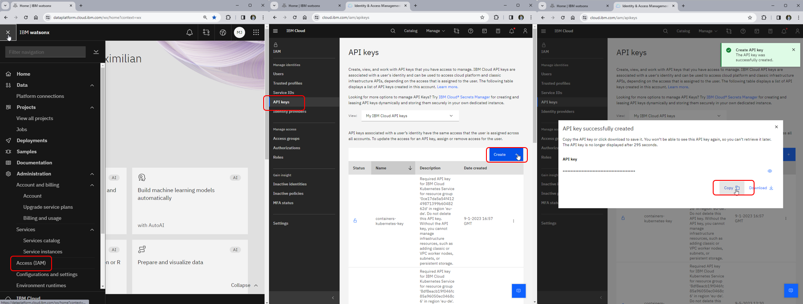
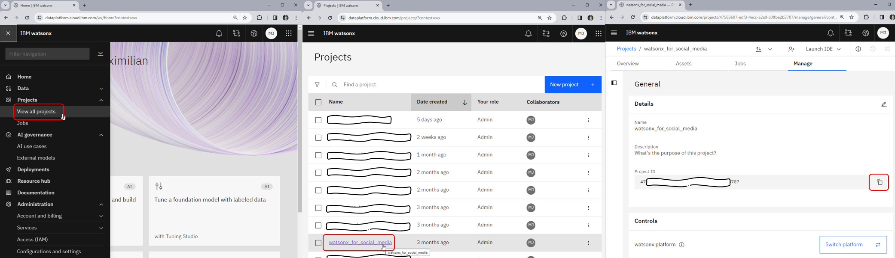

# Analysing Instragram Comments using watsonx!

this notebook shows how you can use large language models hosted in watsonx.ai to analyse instagram comments.

It uses the brand mercedes as an example even though I have no affiliation with them. The concept is the same for any brand.

## Setup

# Install dependencies

Install the required Python packages using pip:

```bash
pip install -r requirements.txt
```

# Get Data from Instagram using instaloader

install and configure instaloader. Refer to their documentation as needed.


```bash
pip install instaloader
instaloader --comments mercedesbenz
```

# Getting watsonx.ai credentials

Go to watsonx.ai and create an account. You will need to create a project and get the API key.


This is how you get your project ID


write those credentials into an .env file with the following format:

```bash
GENAI_KEY=YOUR_KEY_HERE!!!
GENAI_API=https://us-south.ml.cloud.ibm.com
PROJECT_ID=YOUR_PROJECT_ID_HERE!!!
```

# Run the notebook

Run from top to bottom and enjoy! 